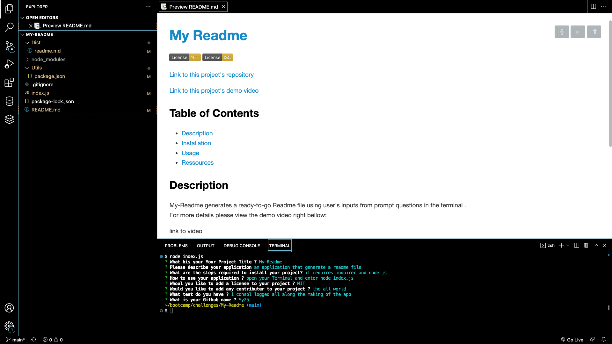

# [My Readme](https://github.com/Saidou25/My-Readme)

 

[Link to this project's repository](https://github.com/Saidou25/My-Readme)

[Link to this project's demo video](https://drive.google.com/file/d/1quX_I1C5X8KvbVWrpW3F8fdx8Cl_JiOj/view)

## Table of Contents

* [Description](#description)

* [Installation](#installation)

* [Usage](#usage)

* [Ressources](#resources)

## Description

My-Readme generates a ready-to-go Readme file using user's inputs from prompt questions in the terminal . 
For more details please view the demo video right bellow:

## Installation

* Clone the repository to your GitHub.
* Intall  node js runninb npm install.
* Install inquirer.

## Usage

Start with opening your Terminal, enter node index.js then answer the questions.

## Resources
This project was created using node and inquirer.

